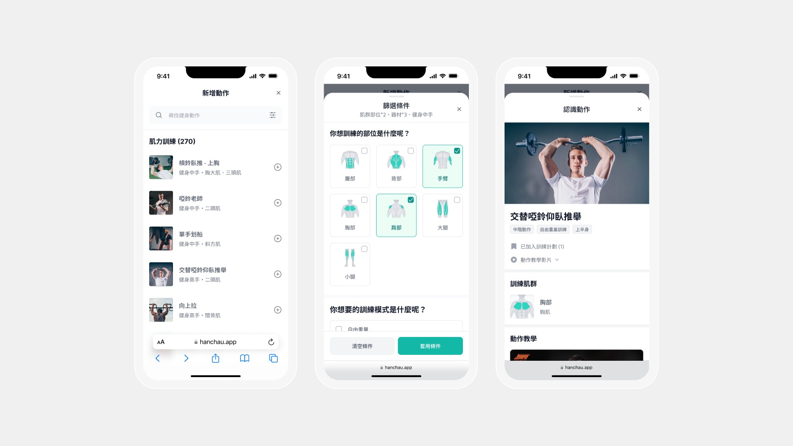

[](https://hanchau.app/)
[](https://nodejs.org/en)
[](https://react.dev/)
[](https://vitejs.dev/)


## :computer: **Techniques**

[](https://react.dev/)
[](https://reactrouter.com/)
[](https://redux.js.org/)
[](https://vitejs.dev/)
[](https://www.typescriptlang.org/)
[](https://eslint.org/)
[](https://storybook.js.org/)
[](https://tailwindcss.com/)
[](https://ant.design/)
[](https://firebase.google.com/)

## :clipboard: **Product Introduction**

Hanchau.app is a fitness and nutrition tracking application designed to help users monitor their exercise routines and track their nutritional intake. The app aims to simplify the process of recording and analyzing workout data while providing a convenient way to monitor daily food consumption. Whether you are a fitness enthusiast, a beginner, or someone looking to maintain a healthy lifestyle, Hanchau.app offers a comprehensive solution to help you achieve your fitness and nutrition goals.

## :pushpin: **Key Features**

### **User Profiles**

Create personalized profiles with information such as age, height, weight, fitness goals, and activity levels. This allows Hanchau.app to provide tailored recommendations and track progress based on individual needs.

.png>)
 
### **Workout Plans**

Access pre-built or customizable workout plans tailored to your specific goals and fitness levels. Hanchau.app provides a variety of strength training workouts designed to help you build muscle, increase strength, or improve endurance.


### **Activity Tracking**

Easily track any gym workout activities. Enter details such as sets, reps, weights, and more to keep a comprehensive record of your exercises.


### **Exercise Library**

Explore a thorough library of exercises with detailed instructions, images, and videos. Whether you're new to a specific exercise or want to perfect your form, the exercise library provides valuable resources to guide you.



### **Progress Tracking**

Keep track of your progress over time with metrics such as weight, body measurements, and fitness achievements. Visualize your progress through graphs or charts to gain insights into your fitness journey and stay motivated.

### **Nutrition Tracking**

Monitor your daily food intake, calories, macronutrients, and water consumption to ensure a balanced and healthy diet. Hanchau.app helps you track and analyze your nutritional habits, allowing you to make informed choices to support your fitness goals.

### **Goals and Milestones**

Set goals and milestones to track your progress and celebrate achievements along the way. Hanchau.app provides a sense of accomplishment and motivation as you work towards your desired outcomes.

## :bricks: **Component System**

Utilizing TailwindCSS as the CSS foundation and integrating certain components from Ant-Design, the component system demonstrates multiple situations in Storybook that you can discuss with designers more efficiently in the early stage of development. Incorporated branding styles into existing component libraries and CSS guidelines to kickstart design system implementation, synchronizing the language between design and development. Storybook serves as both a component system and documentation, allowing you to directly grasp the purpose and the complete usage of each parameter.

You can experience the live demonstration of the component system through this <a href="https://jerry-yeh.github.io/Han-Chau" target="_blank">**link➜**</a>.


## :key: **Instructions**

1. Clone Project

   ```
   git clone https://github.com/Jerry-Yeh/Han-Chau
   ```

2. Install Packages

   ```
   npm i
   ```

3. Start Project (Use 5173 as the default port)

   ```
   npm run dev
   ```

4. Build Project

   ```
   npm run build
   ```

5. Firebase

   - Install the Firebase CLI

     ```
     npm i firebase-tools -g
     ```

   - Init a new Firebase project

     ```
     firebase init
     ```

   - Deploy project

     ```
     firebase deploy
     ```

6. Storybook

   - Develop

     ```
     npm run storybook
     ```

   - Build

     ```
     npm run storybook:build
     ```

   - Deploy

     ```
     npm run storybook:deploy
     ```

7. TypeScript Check

   ```
   npm run tsc
   ```

8. ESLlint Check

   ```
   npm run lint
   ```

## :building_construction: **Structure**

```
/
├─ src/
│  ├─ assets/          # Assets
│  │  └─ img/          # SVG images, icons and logos
│  │
│  ├─ components/      # Reusable components
│  ├─ enums/           # Enums defined by TypeScript
│  ├─ locales/         # Handle wording with i18n
│  │  ├─ en.json       # English
│  │  └─ zh_TW.json    # Traditional Chinese
│  │
│  ├─ hooks/           # React custom hooks
│  ├─ pages/           # UI pages
│  ├─ router/          # Managing route with React Router
│  ├─ services/        # API, formula and utils function
│  ├─ state/           # Managing state with XState
│  ├─ static/          # Static data
│  ├─ store/           # Managing global data with Redux
│  ├─ stories/         # Component showcase
│  ├─ style/           # CSS style
│  ├─ typings/         # Type definition for the third party library and utility type
│  │
│  ├─ App.tsx          # Root component
│  ├─ main.tsx         # Render the root component
│  └─ i18n.js          # i18n settings
│
├─ dist/               # Files required for dynamic builds (ignored by Git)
├─ public/             # Public build (ignored by Git)
├─ storybook-static/   # Public build for Storybook (ignored by Git)
│
├─ .env                # Loaded environment variables in all cases
├─ .env.d.ts           # Type definitions for environment variables
├─ .env.local          # Loaded environment variables in all cases (ignored by Git)
├─ .firebaserc         # Deployed Firebase project
├─ firebase.json       # Deployed Firebase files and folders
├─ .gitignore          # List of files and folders not tracked by Git
├─ .prettierrc         # Defining coding style by Prettier
├─ .prettierignore     # List of files and folders not tracked by Prettier
├─ .eslintrcignore     # List of files and folders not tracked by ESLint
├─ .eslintrc.json      # Linting preferences for JavasScript
├─ postcss.config.js   # PostCSS settings
├─ tailwind.conifg.cjs # TailwindCSS settings
├─ tsconfig.json       # TypeScript settings
├─ vite.config.ts      # Vite settings
├─ index.html          # Entry point
├─ package.json        # Project manifest
└─ README.md           # This file
```

## :warning: **Challenges and Obstacles**

During the development of Hanchau.app, several challenges and obstacles were encountered. One of the initial concerns was ensuring the accuracy of the content provided within the app. To address this, reliable open sources funded by governments were extensively researched to obtain verified exercise and nutrition data.

Additionally, time management was a crucial aspect as the project was undertaken while the team members still had full-time jobs. To optimize development efforts, existing development tools such as Firebase were utilized, allowing the team to focus on implementing key features without compromising quality.

## :sparkles: **Results**

While Hanchau.app is still under development, the team is actively seeking testing opportunities among friends and family to gather valuable user feedback. The app's focus on providing a seamless and efficient record-taking experience, without unnecessary features, sets it apart from other fitness and nutrition tracking applications. The team's commitment to privacy and data security is ensured through the utilization of Firebase's robust infrastructure, including authentication and Firestore database.

Working on Hanchau.app has provided the team members with valuable learning experiences. As developers, they have had the opportunity to collaborate closely with a designer, gaining insights into product development and enhancing communication skills. Being responsible for the entire development process has allowed them to expand their knowledge and decision-making abilities. As a designer, it is always tricky when it comes to side projects. It is one thing that a designer designs something beautiful, and it is another that a design gets actually developed. Having a dev partner definitely makes a side project so much more meaningful for a designer as product design is never only about creating the visuals but also the consideration of market fit, tech constraints, and how the problems are being solved.

## :trollface: **Collaborator**

**Designer**

[Henk Hsieh](https://www.linkedin.com/in/henkhsieh/)

**Software Engineer**

[Jerry Yeh](https://www.linkedin.com/in/jerryyyeh/)

[Button Icon]: https://img.shields.io/badge/Visit%20project-14B8A6?style=for-the-badge&logoColor=white

[![Button Icon]](https://hanchau.app/)
